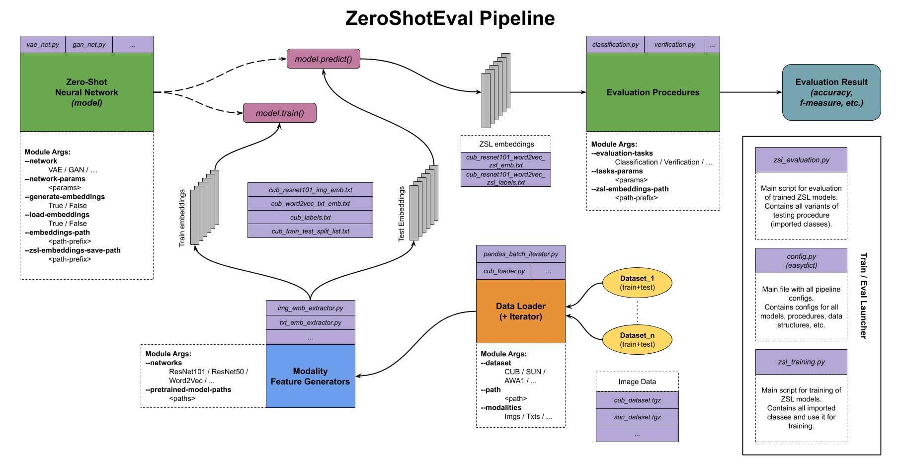

ZeroShotEval - A Python Toolkit for Zero-Shot Learning
======================================================

**ZeroShotEval** is designed for **evaluation** of Machine Learning models suitable for solving problems in the field of **Zero-Shot Learning (ZSL)**.

The main motivation is to create a **universal evaluation pipeline** that allows to compare miscellaneous ZSL models under the same conditions (for an honest comparison).

This toolkit provides the ability to **construct ZSL models** with various insides, e.g. miscellaneous NN architectures, and thus configure the desired experiment setting.

The pipeline of construction and evaluation consists of **4 steps**:
1. Loading of multiple data sets for training and evaluation.
2. Extraction of pure modalities* features using different nets (e.g. ResNet, BERT etc.) as a part of data preparation before Zero-Shot Learning.
3. Zero-Shot training and inference with different experimental nets.
4. Evaluation of the obtained inference using various testing procedures (e.g. solving classification problem, verification on pairs, clusters measurements)

\* *Modality is a type of data to be processed, such as images, texts, attributes etc.*

The pipeline is schematically depicted in the figure below.



*NOTE: in the figure there are examples of Python scripts and its names. Please note that it is work names for visualizing the structure of the project and it can be changes during development.*

**This scheme is still under development!**

# Getting started

## 1. Installation
This project is designed as a pip package to be build and installed locally to virtual environment.

**Requirement: Python 3.5, 3.6 or 3.7**

*NOTE: The following installation process is for Linux only.*

It is recommended to use [virtualenv](https://virtualenv.pypa.io/en/latest/). To install module locally to the virtual environment:

```bash
chmod 755 build_venv.sh
./build_venv.sh
```

This command will create a virtual environment in `./.venv` local directory.  

Execution of this shell script will install all necessary packages into your Python interpreter.
List of all packages can be found in `requirements.txt`.

## 2. Running Example
To perform a test run complete the following steps:

**Step 1:** Our suggestion is to perform a test run on the [Caltech-UCSD Birds-200-2011](http://www.vision.caltech.edu/visipedia/CUB-200-2011.html) (CUB) dataset. To use it run the downloader script in `utils` directory:

```bash
chmod 755 utils/cub_download.sh
./utils/cub_download.sh
```  

**Step 2:** To perform a test run, execute `run_example.sh` shell script. It will run the script on the test data from the CUB dataset downloaded to the `data/` folder.  

```bash
chmod 755 run_example.sh
./run_example.sh
```  

## 3. Launch Configuration
To make it work with your data, just copy the script `run_example.sh` and change the arguments to the ones that suit your data. All arguments descriptions are provided in the script.

You can also launch the project directly through the main Python script. Use the following command as the example:

```bash
python ...
```  

Or use all avaliable parameters to make a detailed configuration:

```bash
python ...
```  

Detailed description of the arguments can be printed using:

```bash
python ... --help
```  

### Detailed configuration

*TODO: Describe how to work with `config.py`*

# Implementation details

*TODO: Fill in implementation details*

# Contribute

*TODO: Fill in contribution details*
